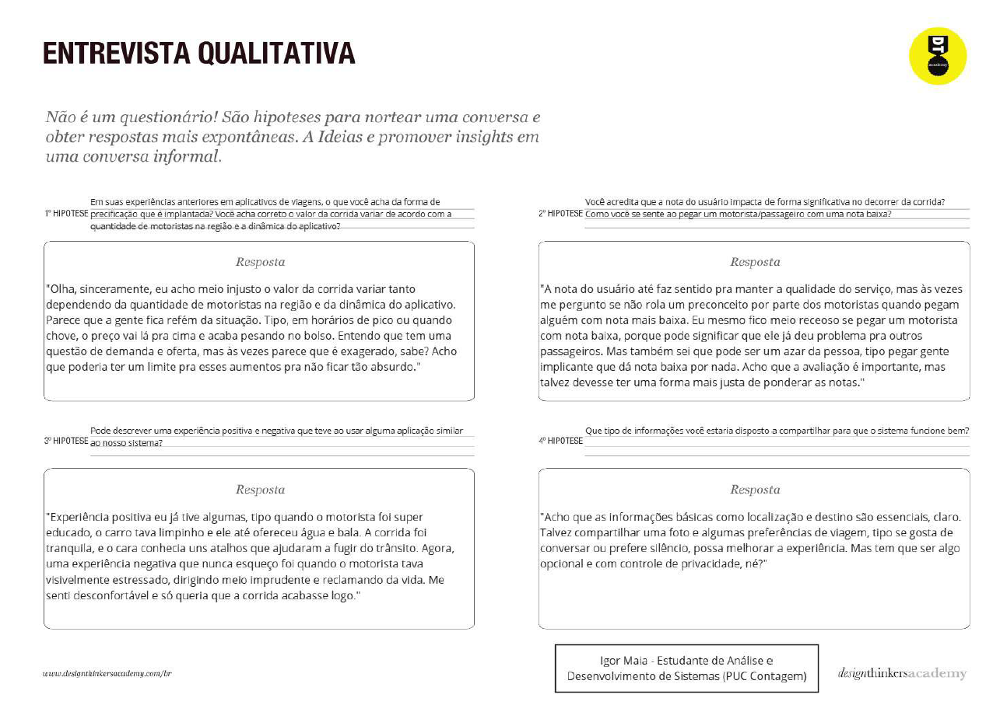
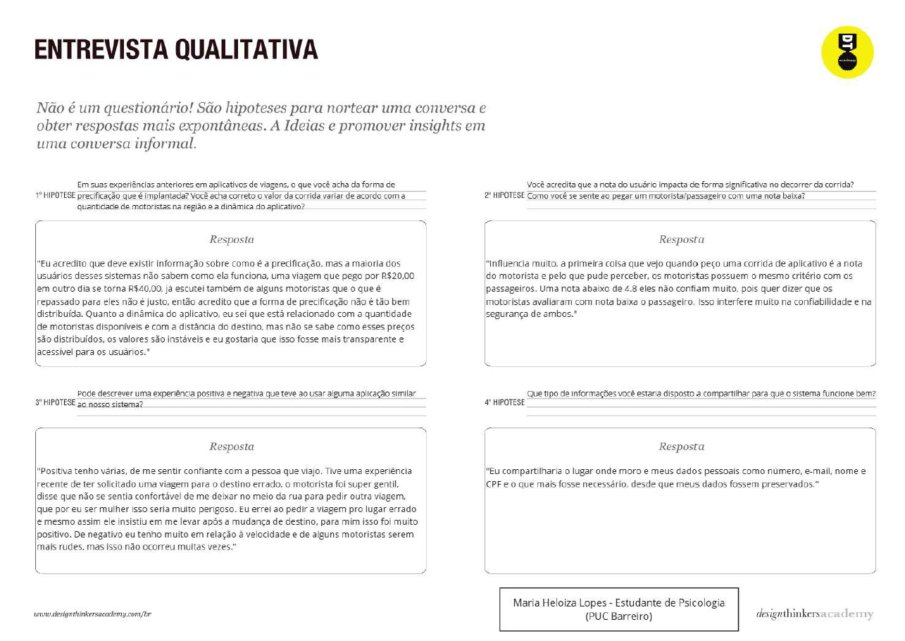
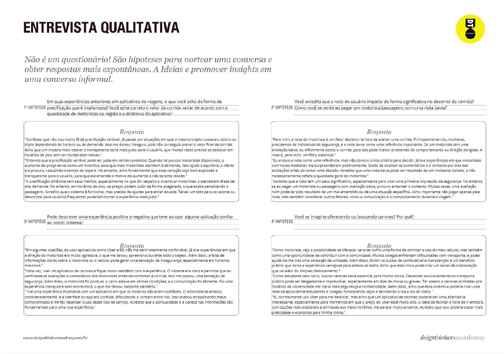
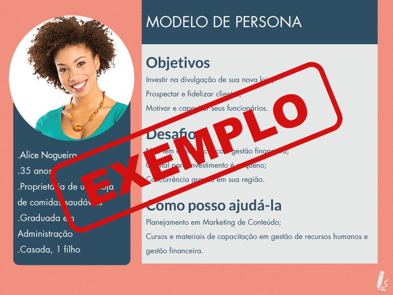

# Product discovery

Pré-requisitos: <a href="01-Contexto.md"> Documentação de contexto</a>

✅ [Documentação de Design Thinking (MIRO)](files/processo-dt.pdf)

## Etapa de entendimento

**✳️✳️✳️ APRESENTE OS ARTEFATOS DA ETAPA  ✳️✳️✳️**

> * **Matriz CSD**: 

> * **Mapa de stakeholders**: 
> * **Entrevistas qualitativas**: 
> * **Highlights de pesquisa**: 

> **Links úteis**:
> - [Mapa de stalkeholders](https://www.racecomunicacao.com.br/blog/como-fazer-o-mapeamento-de-stakeholders/)

## Etapa de definição

### Personas

**✳️✳️✳️ APRESENTE OS DIAGRAMAS DE PERSONAS ✳️✳️✳️**

> ⚠️ **APAGUE ESTA PARTE ANTES DE ENTREGAR SEU TRABALHO**
>
> Deve-se relacionar as personas identificadas no projeto, juntamente com os respectivos mapas de empatia. É importante enumerar e descrever de maneira precisa e personalizada todos os principais envolvidos na solução pretendida.

> **Links úteis**:
> - [Rock Content](https://rockcontent.com/blog/personas/)
> - [Criar personas (Hotmart)](https://blog.hotmart.com/pt-br/como-criar-persona-negocio/)
> - [O que é persona?](https://resultadosdigitais.com.br/blog/persona-o-que-e/)
> - [Persona x público-alvo](https://flammo.com.br/blog/persona-e-publico-alvo-qual-a-diferenca/)
> - [Qual a diferença entre público-alvo e persona?](https://rockcontent.com/blog/diferenca-publico-alvo-e-persona/)
