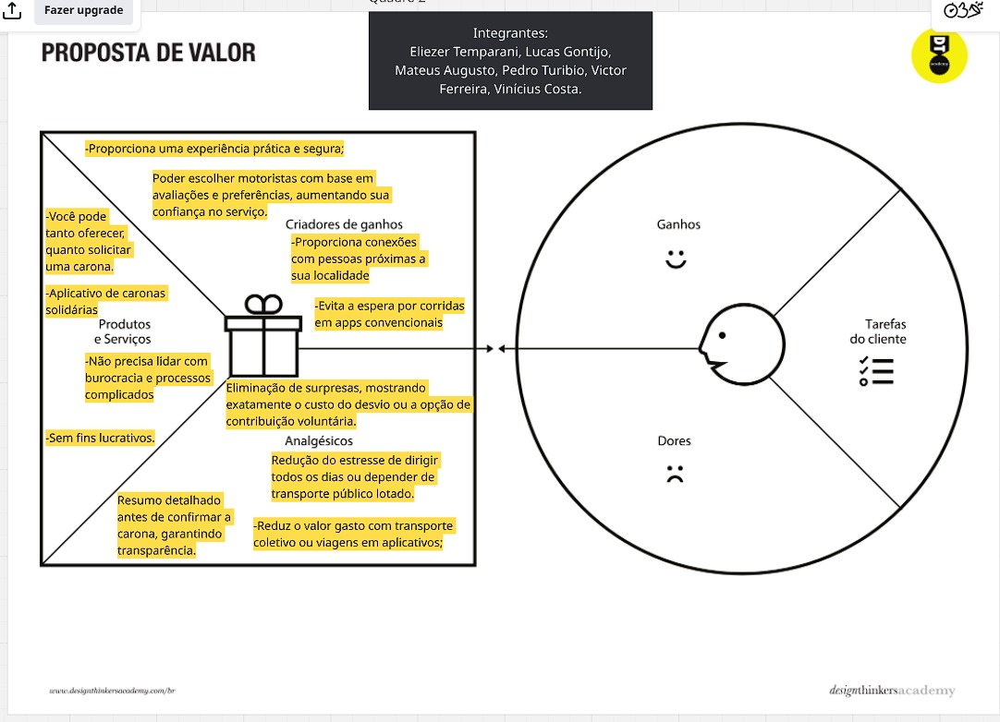

# Product design

Pré-requisitos: <a href="02-Product-discovery.md"> Product discovery</a>

> ⚠️ **APAGUE ESTA PARTE ANTES DE ENTREGAR SEU TRABALHO**

Neste momento, transformam-se os insights e validações obtidos em soluções tangíveis e utilizáveis. Esta fase envolve a definição de uma proposta de valor, detalhando a prioridade de cada ideia, e a consequente criação de wireframes, mockups e protótipos de alta fidelidade, que especificam a interface e a experiência do usuário.

## Histórias de usuários

Com base na análise das personas, foram identificadas as seguintes histórias de usuários:

|EU COMO... `Passageiro`| QUERO/PRECISO ... `Avaliar Minhas Corridas` |PARA ... `Manter a qualidade do serviço`                 |
|--------------------|------------------------------------|----------------------------------------|

|EU COMO... `Passageiro`| QUERO/PRECISO ... ` informações do veículo e do motorista antes de iniciar a corrida` |PARA ... `saber de estou entrando no carro correto e com o motorista certo`                 |
|--------------------|------------------------------------|----------------------------------------|

|EU COMO... `Passageiro`| QUERO/PRECISO ... `cadastrar minhas informações` |PARA ... `facilitar a minha identificação para o motorista`                 |
|--------------------|------------------------------------|----------------------------------------|

|EU COMO... `Motorista`| QUERO/PRECISO ... `Poder cancelar uma carona` |PARA ... `Em caso de atraso do passageiro`                 |
|--------------------|------------------------------------|----------------------------------------|

|EU COMO... `Motorista`| QUERO/PRECISO ... `Avaliar os passageiros` |PARA ... `Poder compartilhar a minha experiência com os outros motoristas`                 |
|--------------------|------------------------------------|----------------------------------------|

|EU COMO... `Motorista`| QUERO/PRECISO ... `Poder bloquear passageiros com nota baixa` |PARA ... `E vitar passar por situações negativas ao usar o sistema`                 |
|--------------------|------------------------------------|----------------------------------------|

> **Links úteis**:
> - [Histórias de usuários com exemplos e template](https://www.atlassian.com/br/agile/project-management/user-stories)
> - [Como escrever boas histórias de usuário (user stories)](https://medium.com/vertice/como-escrever-boas-users-stories-hist%C3%B3rias-de-usu%C3%A1rios-b29c75043fac)
> - [User stories: requisitos que humanos entendem](https://www.luiztools.com.br/post/user-stories-descricao-de-requisitos-que-humanos-entendem/)
> - [Histórias de usuários: mais exemplos](https://www.reqview.com/doc/user-stories-example.html)
> - [9 common user story mistakes](https://airfocus.com/blog/user-story-mistakes/)

## Proposta de valor

**✳️✳️✳️ APRESENTE O DIAGRAMA DA PROPOSTA DE VALOR PARA CADA PERSONA ✳️✳️✳️**

##### Proposta para a persona XPTO ⚠️ EXEMPLO ⚠️

![proposta de valor]  

>

> **Links úteis**:
> - [O que é o canvas da proposta de valor e como usar?](https://www.youtube.com/watch?v=Iqb-8Q_eiiA)

## Requisitos

As tabelas a seguir apresentam os requisitos funcionais e não funcionais que detalham o escopo do projeto. Para determinar a prioridade dos requisitos, aplique uma técnica de priorização e detalhe como essa técnica foi aplicada.

### Requisitos funcionais

| ID     | Descrição do Requisito                                   | Prioridade |
| ------ | ---------------------------------------------------------- | ---------- |
| RF-001 | No sistema, poderá haver pagamento pela carona, porém, será opcional do usuário realizá-lo ou não⚠️ | MEDIA      | 
| RF-002 | Haverá na tela inicial do usuário alguns filtros que servirão para exibir somente as caronas que se aplicam àquelas características informadas⚠️ | ALTA    
| RF-003 | Para usuários que são motoristas, aparecerá na tela principal, o histórico de caronas realizadas em um período específico que será discutido pela equipe⚠️ | MEDIA
 | RF-004 | O sistema terá um limite de distância para o desvio de rota, pois, caso a distância se altere muito, a carona perde o sentido ⚠️ | ALTA
| RF-005 | Ao realizar o primeiro login, será solicitado aos usuários algumas informações complementares para comporem o seu perfil (exemplo: data de nascimento, nome completo, etc)⚠️ | MEDIA
| RF-006 | Para o usuário motorista, haverá um botão na página inicial onde será possível criar uma carona. Ao aperta-lo, serão necessárias as seguintes informações: ponto de partida, ponto de destino, horário da carona e quantidade de vagas ⚠️ | ALTA
| RF-007 | Para as mulheres que utilizarão o nosso sistema, será possível selecionar caronas que serão feitas somente por motoristas mulheres, dessa forma, conseguimos de forma indireta, garantir um pouco mais de segurança e passar credibilidade;⚠️ | ALTA
| RF-008 | O sistema permitirá que os usuários avaliem as caronas realizadas, atribuindo uma nota e deixando um comentário opcional, ajudando a construir um histórico de confiabilidade para motoristas e passageiros⚠️ | ALTA
| RF-009 | A nota do usuário aparecerá em formato pop-up juntamente com as informações relevantes daquele perfil | BAIXA
| RF-010 | Utilizaremos alguma api de mapas para podermos acompanhar o trajeto do motorista até o nosso ponto de encontro e posteriormente até o destino final (iremos consumi-la pelo front-end)| ALTA

### Requisitos não funcionais

| ID      | Descrição do Requisito                                                              | Prioridade |
| ------- | ------------------------------------------------------------------------------------- | ---------- |
| RNF-001 | O sistema deverá ser responsivo e funcionar em diferentes navegadores de forma adequada  | MÉDIA     |
| RNF-002 | O código deve ser feito de forma adequada: indentação, padrões de nomenclatura para as variáveis, etc.   | ALTA      |