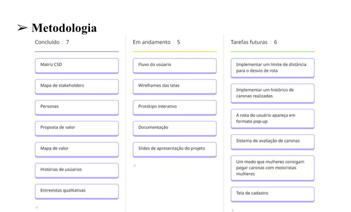

# Metodologia

Pré-requisitos: <a href="03-Product-design.md"> Product design</a>

Descreva aqui a metodologia de trabalho do grupo para abordar o problema. Inclua definições sobre os ambientes de trabalho utilizados pela equipe para desenvolver o projeto. Isso abrange a relação dos ambientes utilizados, a estrutura para a gestão do código-fonte, além da definição do processo e das ferramentas por meio dos quais a equipe se organiza (gestão de equipes).

## Relação de ambientes de trabalho

Os artefatos do projeto são desenvolvidos a partir de diversas plataformas. A relação dos ambientes com seus respectivos propósitos deverá ser apresentada em uma tabela que especifique e detalhe Ambiente, Plataforma e Link de Acesso. Defina também os ambientes e frameworks que serão utilizados no desenvolvimento de aplicações móveis.

## Controle de versão

Controle de versão feito com o modelo kanban.

## Planejamento do projeto

###  Divisão de papéis

• Vinicius Costa: Matriz CSD, Mapa de stakeholders, Personas, Proposta de valor, Mapa de valor, Histórias de usuários, entrevistas qualitativas, Documentação.
• Victor Ferreira: Matriz CSD, Mapa de stakeholders, Personas, Proposta de valor, Mapa de valor, Histórias de usuários, entrevistas qualitativas, Documentação.
• Eliezer Temperani: Matriz CSD, Mapa de stakeholders, Personas, Proposta de valor, Mapa de valor, Histórias de usuários, entrevistas qualitativas.
• Lucas Gontijo: Matriz CSD, Mapa de stakeholders, Personas, Proposta de valor, Mapa de valor, Histórias de usuários, entrevistas qualitativas, Protótipo interativo.
• Mateus Augusto: Matriz CSD, Mapa de stakeholders, Personas, Proposta de valor, Mapa de valor, Histórias de usuários, entrevistas qualitativas, Wireframe.
• Pedro Reis: Matriz CSD, Mapa de stakeholders, Personas, Proposta de valor, Mapa de valor, Histórias de usuários, entrevistas qualitativas, slides de apresentação.
• Tarefas futuras: Em discussão.

### Processo

### Ferramentas

MIRO https://miro.com/pt/ = Fazer os modelos das entregas: Persona, Proposta de valor, Entrevistas qualitativas.
CANVA https://www.canva.com/ = Fizemos os slides da apresentação.
Discord https://discord.com/ = Reuniões para discutir o trabalho.
Wireframe https://mockflow.com/ = Projeto de interfaces.

 
 
